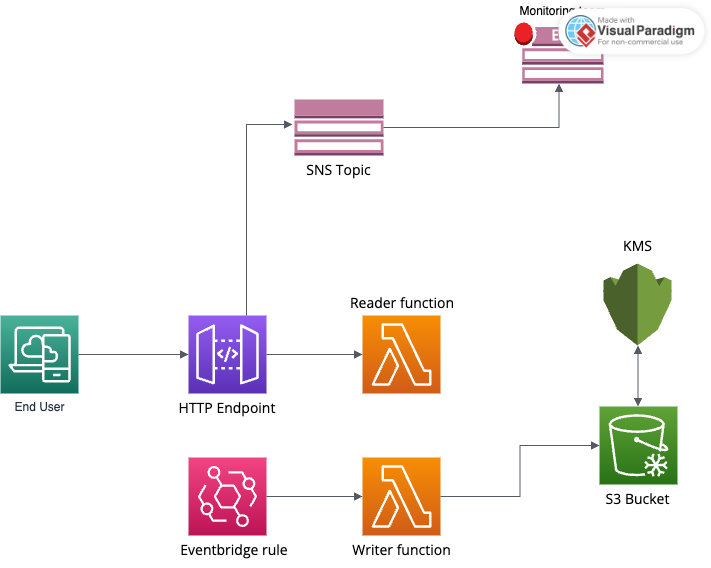

# AWS Serverless Application Overview

## Solution Summary

This document outlines the architecture of a serverless application deployed on AWS, leveraging Terraform for infrastructure management. The solution utilizes AWS Lambda, Amazon S3, AWS KMS, and Amazon CloudWatch to create a scalable, secure, and cost-effective application.

### Services and Components

- **AWS Lambda**: Chosen for its serverless execution, eliminating server management and providing automatic scaling.
- **Amazon S3**: Utilized for its highly durable and available storage, ideal for any amount of data storage and retrieval.
- **AWS KMS**: Provides key management services, ensuring data encryption and security.
- **Amazon CloudWatch**: Used for monitoring the application, offering insights into performance and operational health.

### Cost Implications

- **Lambda**: Costs increase with the number of requests and compute time used.
- **S3**: Costs depend on data storage, request numbers, and data transfer volumes.
- **KMS**: Costs are based on the number of encryption/decryption operations.

### Monitoring with CloudWatch

CloudWatch is employed to monitor resource usage and application performance, with metrics and alarms set up for timely alerts on issues affecting availability and performance.

### Disaster Recovery Strategy

- **S3 Cross-Region Replication**: Ensures data availability and durability across AWS regions.
- **Lambda Multi-Region Deployment**: Enhances application availability and resilience.

### AWS Well-Architected Framework Compliance

- **Operational Excellence**: Achieved through automation and monitoring.
- **Security**: Ensured via data encryption with KMS and IAM for access control.
- **Reliability**: Supported by S3's durability and Lambda's scalability.
- **Performance Efficiency**: Serverless architecture adjusts resources based on demand.
- **Cost Optimization**: The pay-as-you-go model keeps costs aligned with usage.

### Trade-offs and Comparison

- **Serverless vs. Server-Based**: Serverless provides ease of management and scalability, potentially at the cost of higher latency (cold starts).
- **Managed Services vs. Custom Solutions**: AWS managed services simplify security and operations but may limit customization compared to self-hosted solutions.

## Conclusion

The chosen architecture offers a balanced approach, optimizing for cost, scalability, and maintainability, suitable for a wide range of applications. Depending on specific needs, alternative solutions or additional services may be considered to address unique requirements.
