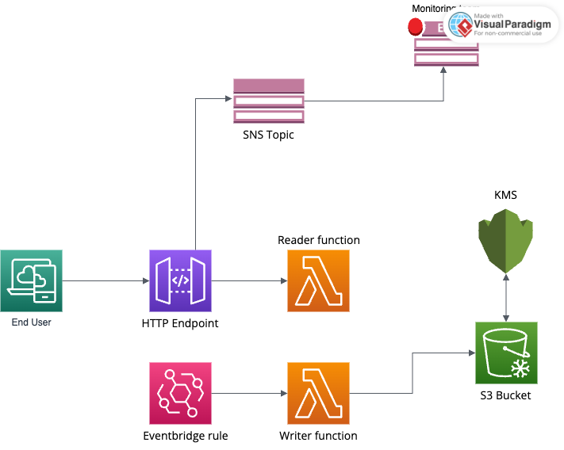

# AWS Lambda S3 File Uploader

## Overview

This project consists of an AWS Lambda function designed to upload files to an AWS S3 bucket. It's triggered by an AWS EventBridge rule, running at a predefined schedule to ensure timely updates. A more detailed summary can be found in the Documentation folder

## Prerequisites

- AWS Account
- AWS CLI installed and configured
- Python 3.x (for Lambda function development)
- Install [Terraform](https://www.terraform.io/downloads.html)

## Setup Instructions

### Prepare the Lambda Function

1. **Create the Lambda Function Script**: Lambda functions can be found in functions folder
2. **Package Your Lambda Function**: Include the Lambda script and any dependencies (e.g., the `requests` library) in a ZIP file for deployment.

### Terraform Configuration

1. **Define AWS Provider and Resources**: Use Terraform to define your AWS resources, including the Lambda function, IAM roles, S3 bucket, and EventBridge rule.
2. **Initialize Terraform**: Run `terraform init` in your terminal to initialize the working directory containing your Terraform configuration files.
3. **Deploy with Terraform**: Apply your configuration using `terraform apply` to create the resources in your AWS account.

## Deployment

- **Manual Deployment**: Upload the ZIP package to Lambda through the AWS Management Console or AWS CLI.
- **Terraform Deployment**: Use the provided Terraform configuration to deploy the Lambda function and related resources automatically.

## Usage

- The Lambda function is triggered automatically according to the schedule defined in the EventBridge rule.
- To manually invoke the Lambda function for testing, use the AWS Management Console or AWS CLI.
- **After all resources are deployed. Run a terraform output to get the url of the api gateway endpoint**

## Tear-down Instructions

To remove the deployed infrastructure:

1. Run `terraform destroy`.

## Troubleshooting

- **Logs**: Check CloudWatch Logs for execution logs of the Lambda function for debugging.
- **Permissions**: Ensure the IAM role associated with the Lambda function has the necessary permissions for S3 and EventBridge.

## Contributing

Contributions to enhance functionality or address issues are welcome. Please follow the standard fork and pull request workflow.
